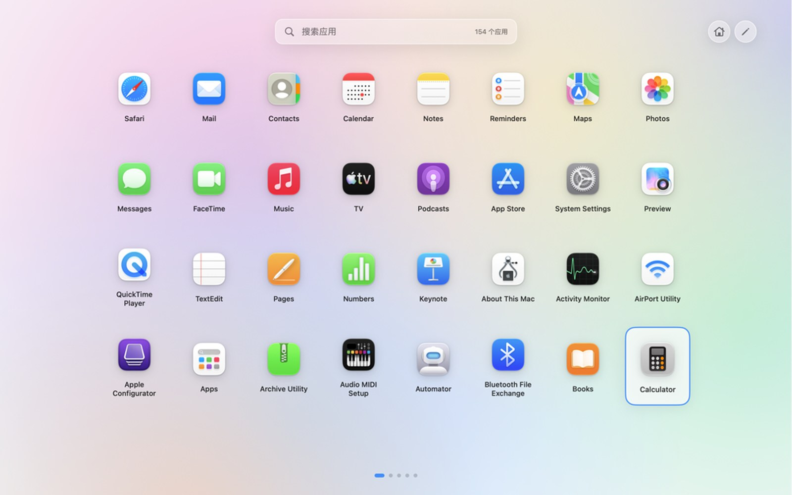

# Launchpad Lite

**把 macOS 那个越改越难用的启动台，换回原来顺手的样子。**



新版 macOS 把启动台改成了「应用程序」文件夹的样子，很多人用不惯。这个 App 就是一个替代品：打开还是熟悉的**全屏图标网格**，按 `F4` 或 `Option + 空格` 随时呼出，能搜索、翻页、拖动排序，也能把不想看到的应用藏起来。

系统要求：macOS 14 或更高。

## 下载安装

到 [Releases](../../releases) 页面下载最新的 `LaunchpadLite-x.y.z.zip`，然后：

1. 解压，把里面的 **LaunchpadLite.app** 拖进「应用程序」文件夹。
2. **第一次打开要右键点它 → 选「打开」**，弹窗里再点一次「打开」。因为这个 App 没有 Apple 开发者签名，直接双击会被系统拦住。如果右键也不让开：打开「系统设置 → 隐私与安全性」，往下找到 Launchpad Lite 那一行，点「仍要打开」。
3. 打开后，菜单栏会出现一个九宫格图标，说明它已经在后台运行了。

屏幕上不会出现常驻窗口，只在菜单栏有个图标 —— 它是随时呼出的面板，不是那种开着窗口的应用。

## 怎么用

### 呼出和关闭

- 按 `F4`（部分键盘要按 `fn + F4`），或按 `Option + 空格`
- 点菜单栏的九宫格图标，或点一下 Dock 图标
- 关闭：按 `Esc`，或点面板里的空白处

### 找应用

- 呼出后直接打字就能搜（应用名、Bundle ID 都能搜到）
- 方向键移动、回车打开
- 触控板左右滑动翻页

### 整理图标

- **按住任意图标往别处拖**就能调整位置，不需要先进什么模式
- 拖动时图标会跟着鼠标浮起来，原位置变成虚线空位，要落下的位置整格高亮
- 拖到**最左或最右一列停一下**（约半秒）会自动翻页，可以把图标搬到别的页，边缘会出现箭头提示
- 想精确挪一格：点右上角铅笔进编辑模式，选中图标后按 `⌥ + ←/→`

### 隐藏不想要的应用

- 点右上角的**铅笔**进入编辑模式，图标右上角会出现 `×`
- 点 `×`（或者直接点图标）就把它从面板里移除 —— **只是隐藏，不会删除文件**
- 被隐藏的图标会变灰、角标变成蓝色 `+`，再点一下就能恢复
- 点「完成」或按 `Esc` 退出编辑模式
- 万一藏多了：菜单栏图标 →「恢复全部隐藏应用」

### 设一个「主页」

- 翻到你想当默认的那一页，点右上角的**房子**图标，它变成蓝色就设好了
- 以后每次打开都直接落在这一页；再点一次就取消

### 其他

- 右键图标：打开 / 在 Finder 中显示 / 从面板移除或恢复
- 菜单栏 →「重新扫描应用」：刚装了新应用、面板里没出现时点它
- 菜单栏 →「添加应用目录…」：可以把外置盘或自定义文件夹里的 App 也扫进来
- 菜单栏 →「重置布局」：顺序乱了，或者想让它按默认规则重新排

## 常见问题

**打开时提示「无法打开，因为 Apple 无法检查它是否包含恶意软件」？**
因为没买 Apple 开发者账号做签名和公证。按上面第 2 步**右键 → 打开**就能用；介意的话也可以照「从源码构建」自己编译一份。

**「移除」会把应用删掉吗？**
不会。只是不在这个面板里显示，文件完全没动，随时能恢复。真要卸载，用右键「在 Finder 中显示」找到它，自己拖进废纸篓。

**它会上传我的数据吗？**
不会。这是个纯本地启动器，不联网、不收集任何信息，所有设置都存在你自己的电脑上。

**每次开机都要手动打开它吗？**
默认不自动启动；想开机就在，可以在菜单栏图标里勾上「登录时启动」。

**面板里少了一个应用，或者顺序不对？**
菜单栏 →「重新扫描应用」刷新列表；顺序乱了用「重置布局」。

## 从源码构建

需要先装 Xcode 命令行工具（`xcode-select --install`）。

```bash
git clone https://github.com/Jerrywang77/LaunchpadLite.git
cd LaunchpadLite

swift test              # 跑测试
./scripts/build-app.sh  # 生成 .build/LaunchpadLite.app
open .build/LaunchpadLite.app
```

想做成给别人下载的压缩包：

```bash
./scripts/package-release.sh
# 产物：dist/release/LaunchpadLite-<版本>.zip
```

项目是 SwiftUI + AppKit 写的，没有第三方依赖。源码都在 `Sources/LaunchpadLite/`：`AppScanner` 负责扫描应用，`LaunchpadViewModel` 管状态和布局，`Views/` 是界面，`LaunchpadLayoutStore` 负责读写布局文件。

## 说明

- 触控板捏合呼出是 macOS 的私有系统能力，公开 API 没法完整模拟。现在提供全局快捷键和菜单栏入口；如果用私有接口硬做，应用就没法通过 Mac App Store 审核，也不适合长期维护。
- 图标拖动是自己实现的手势（系统的拖拽在无边框覆盖层里不工作），点击和拖动共用一套逻辑。
- 布局文件放在 `~/Library/Application Support/Launchpad Lite/layout.json`，删掉它就等于恢复出厂设置。

## 许可

[MIT](LICENSE)：随便用、随便改、可以商用，保留版权声明即可。
